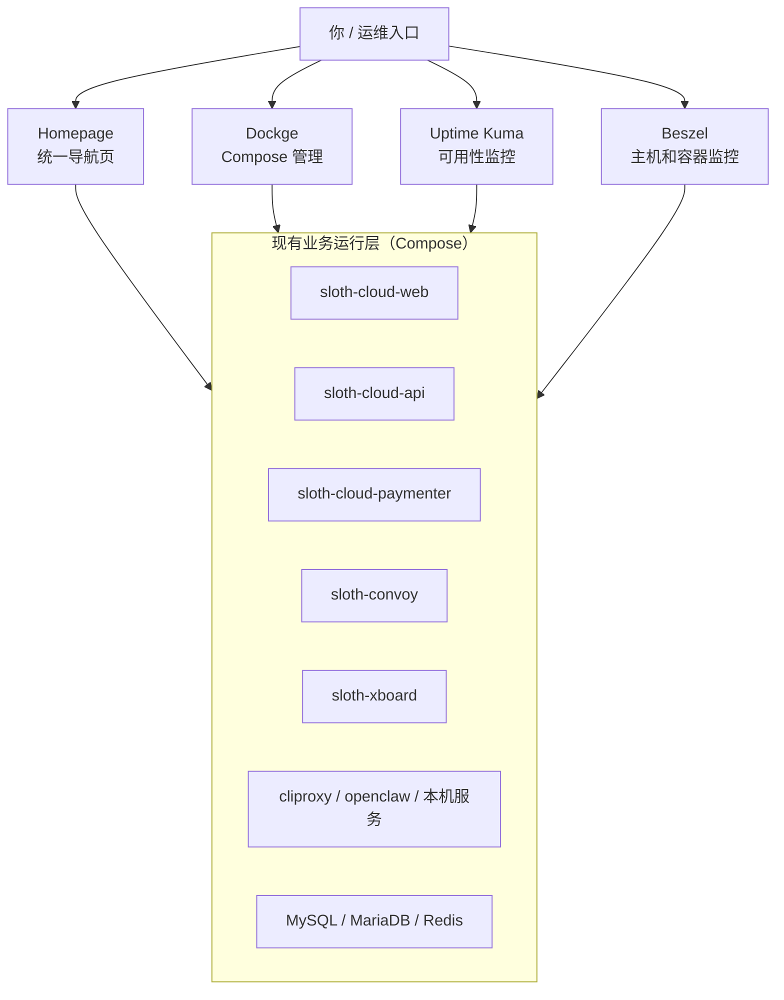
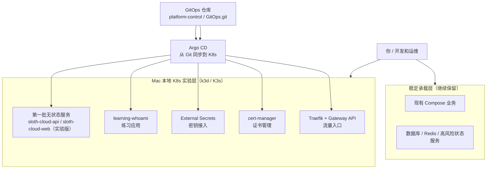
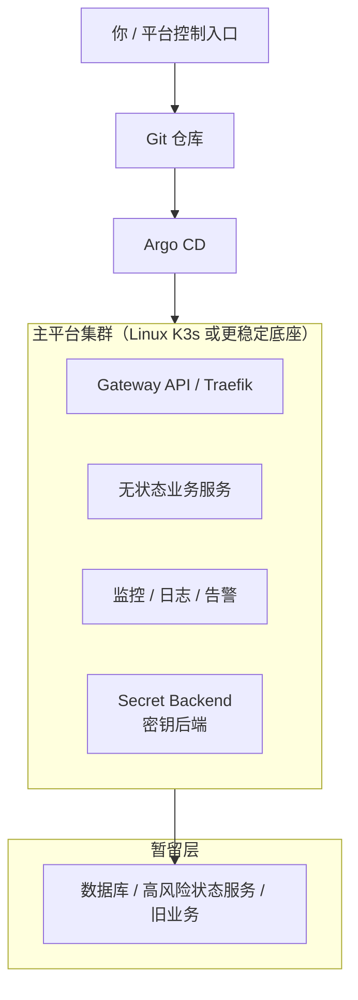
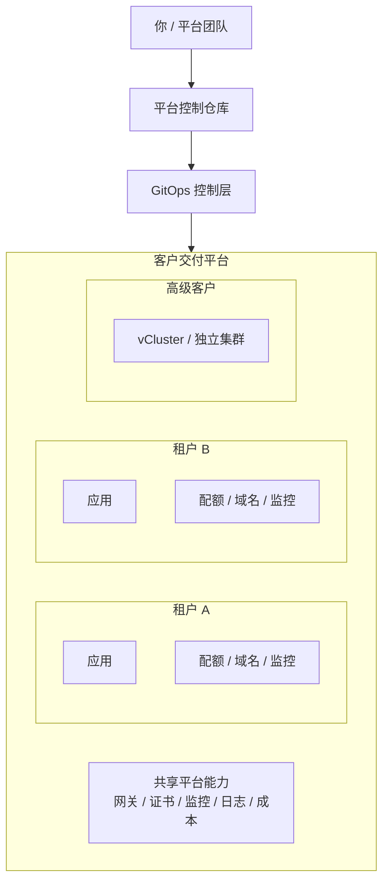

# Runbook: 平台技术路线架构图

## 这份图是干什么的

这份文档不是讲某一个命令。
它是帮助你建立“我们现在在什么位置、下一步往哪里走、最终想长成什么样”的整体地图。

你可以把它理解成：

- 当前运行结构图
- 接下来要做的技术路线图
- 长期面向客户的平台目标图

## 一句话结论

我们现在走的是一条三层路线：

1. 先把现有 `Compose`（Docker Compose 编排）运行面管清楚
2. 再把 `Kubernetes`（K8s，容器编排平台）能力在独立实验层跑成熟
3. 最后把这套能力抽象成能服务客户的平台交付模型

重点不是“一口气全迁到 K8s”。
重点是：

- 现有业务不乱
- 新能力逐步进入
- 最终形成客户可交付的平台标准

---

## 图 1：我们现在的结构

中文理解：

- 现有业务还主要跑在 `Compose`
- `Homepage / Dockge / Uptime Kuma / Beszel` 是我们先补上的“平台管理层”
- 这一层的目标不是替换业务，而是先让你“看得清、管得住、知道哪个是哪个”

---

## 图 2：接下来 1 到 2 个阶段要做的结构

中文理解：

- `Compose` 这一层先不拆，继续承载现在的稳定业务
- `Mac` 上的 `k3d / K3s` 先作为实验集群，专门学 K8s 和验证 GitOps
- 先迁的是：
  - 演示应用
  - 无状态服务
  - 新平台组件
- 暂时不迁的是：
  - 核心数据库
  - Redis
  - 恢复流程不清楚的状态服务

---

## 图 3：中期目标结构

中文理解：

- 到这一步，K8s 不再只是“学习玩具”
- 它开始承载真正的无状态业务
- 但核心状态层还是可能先保留在传统方式里
- 这是一种“混合平台”结构

这正是当前最适合你的路线：

- 不会为了追新把现网搞乱
- 也不会一直困在纯面板和纯 Compose

---

## 图 4：长期面向客户的平台目标

中文理解：

- 长期目标不是“你自己有个 K8s 就结束”
- 而是形成：
  - 统一网关
  - 统一证书
  - 统一监控日志
  - 统一租户边界
  - 统一交付方式

到这一步，你服务的不只是自己，而是客户。

---

## 我们接下来真正要做的 5 步

### 第 1 步：把当前运行面继续标准化

目标：

- 继续让 `Compose` 世界清晰、稳定、可观察
- 确保每个服务都在 `inventory`（台账）里

代表能力：

- Homepage
- Dockge
- Uptime Kuma
- Beszel

### 第 2 步：把 Mac 上的 K8s 学明白

目标：

- 学清楚 `Pod / Deployment / Service / HTTPRoute / Argo CD`
- 让 GitOps 不是抽象词，而是能实操

当前状态：

- 这一步已经开始了
- `learning-whoami` 就是第一个练习对象

### 第 3 步：把第一个真实无状态业务做成实验版

目标：

- 不是直接切现网
- 而是在 K8s 里跑一个 `lab` 版本

候选对象：

- `sloth-cloud-api`
- `sloth-cloud-web`

关键原则：

- 新入口
- 新域名
- 不碰现有 Compose 生产入口

### 第 4 步：补齐平台基础能力

目标：

- 不是“能跑”而已
- 而是“像个平台”

要补的内容：

- 监控
- 日志
- 告警
- 密钥后端
- 镜像仓库策略

### 第 5 步：抽象租户和交付模型

目标：

- 从“自己用”进化到“客户可交付”

未来模型：

- `namespace`：普通托管客户
- `vCluster`：高级客户
- `dedicated-cluster`：独立客户环境

---

## 一句话判断我们现在在哪

如果把整条路线按 10 分算：

- `0 到 3 分`：服务堆着跑，没人搞得清
- `4 到 6 分`：开始有平台控制层，开始有 K8s 实验和 GitOps
- `7 到 8 分`：无状态业务稳定跑进 K8s
- `9 到 10 分`：客户交付平台成熟

我们现在大约在：

- `4.5 到 5.5 分`

也就是：

- 已经脱离“纯乱跑”
- 但还没进入“客户级平台成型”

这个位置是正常的，而且路线是对的。

---

## 你现在最应该怎么理解这条路线

不要把它理解成：

- “要不要全上 Kubernetes”

更应该理解成：

- “现有业务继续稳定运行”
- “新平台能力在 K8s 里成长”
- “成熟一个，迁一个”
- “最后变成客户级交付平台”

这才是我们当前这套技术路线的核心。
